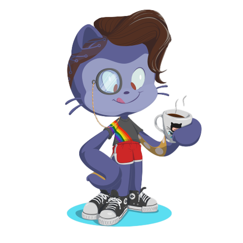

### Oii eu sou Larissa Brasil 👋
- Graduanda em Ciência da Computação - UFPI
- Técnica em Informática - IFPI

### Contato

	
	 

### Tecnologias e Ferramentas

    
	
    	
    	

### Estou aprendendo

 
	      
	  
	
	
	

### Stats
		

