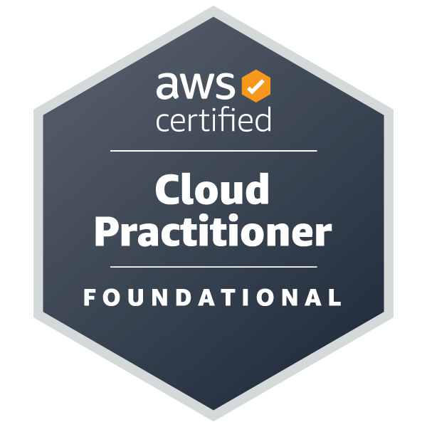

# 👋 Oi, eu sou a Larissa Brasil  
💻 Desenvolvedora **Full-Stack**    
🎓 Graduanda em **Ciência da Computação - UFPI**    
🔧 Técnica em **Informática - IFPI**  

## 🚀 Tecnologias & Ferramentas  

### Front-end
 
 

### Back-end

### Banco de Dados

### Versionamento & Cloud

## 📚 Atualmente aprendendo

	

## 📬 Contato  

	
	 

	

## 📊 GitHub Stats  

  
  

  

